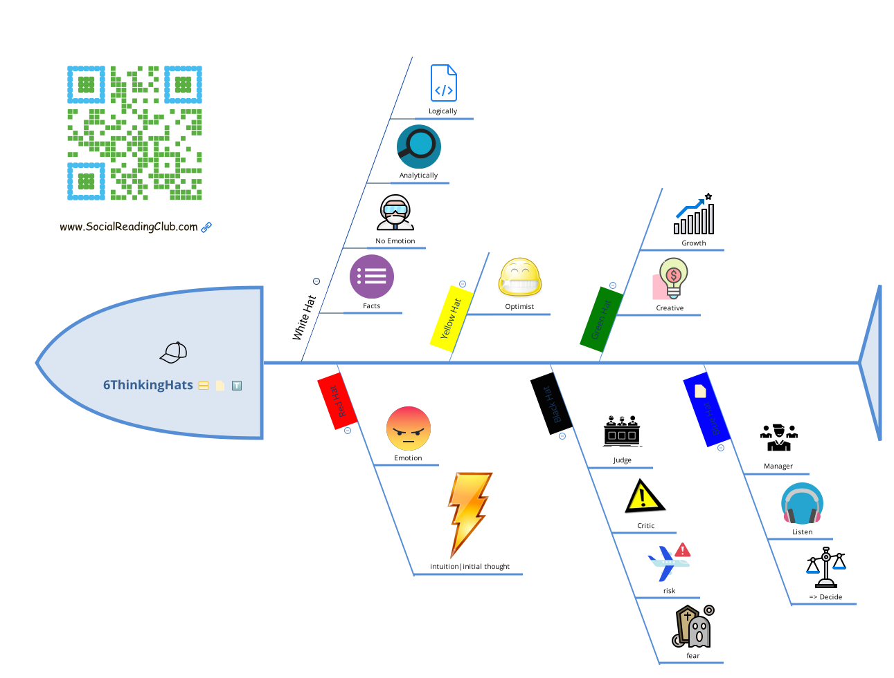

This is the learning journal of the [10-day jumpstart program](https://www.kwiklearningonline.com/) for the Book [Limitless](https://amzn.to/35bNxjW).

### Overview of the course and Brain

### Mindset

### Motivation

### Energy

### Six Thinking Hats

